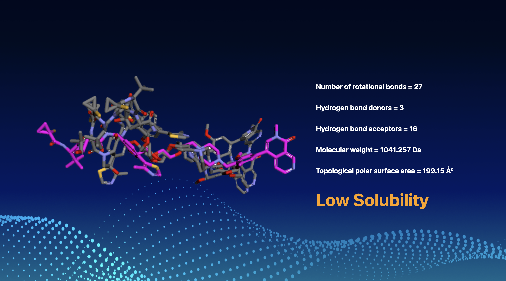

# Solubility Prediction of Large Chameleonic Molecules

## About

This project aims to predict the solubility of large, chameleonic molecules—compounds that alter their shape, influencing their solubility. Understanding solubility is crucial in drug development, as it determines the administration route (oral ingestion vs. intravenous) and impacts dosage considerations that can affect other organs.

## Application Screenshot




## Project Overview

Due to the scarcity of solubility data for large molecules, we trained a Random Forest Regressor using solubility data from small molecules. This model predicts the solubility of larger molecules by evaluating key properties:

- **Number of Rotational Bonds**
- **Hydrogen Bond Donors**
- **Molecular Weight**
- **Topological Polar Surface Area**

Each property is weighted according to its influence on solubility. The model classifies molecules into four solubility categories:

- Highly Soluble
- Soluble
- Low Solubility
- Insoluble

## Technical Implementation

- **Frontend**: Developed using Jinja templating with HTML and CSS.
- **Backend**: Built with Flask to handle API calls.
- **Molecular Property Calculation**: Utilized RDKit to compute molecular properties.
- **3D Molecular Visualization**: Employed PyMOL to generate 3D images of molecules.

## User Interaction

Users can input a molecule's name via a search bar. The application then displays:

- A 3D image of the molecule
- Calculated properties
- Predicted solubility level

## Installation and Setup

1. **Clone the repository**:

   ```bash
   git clone https://github.com/natashagit/kinaseHTGS.git
   
2. **Navigate to the project directory and install dependencies:**:

# To install/update the project's dependencies
```sh
cd kinaseHTGS
pip install -r requirements.txt
```

3. **Run the application**:

   ```bash
   python -m flask run

## Repository Structure

- **app.py**: Main Flask application file.
- **chemistry.py**: Contains functions for molecular property calculations.
- **prediction.py**: Handles the solubility prediction logic.
- **templates/**: Directory for HTML templates.
- **filtered_SOL.csv**: Dataset for small molecules.
- **requirements.txt**: Lists all Python dependencies.
- **visualize.ipynb**: Used to create 3D images of molecules

## Tools and Libraries

This project utilizes the following tools and libraries:

- **[Flask](https://flask.palletsprojects.com/)**: For backend development.
- **[RDKit](https://www.rdkit.org/)**: For molecular property computations.
- **[PyMOL](https://pymol.org/2/)**: For 3D molecular visualizations.


